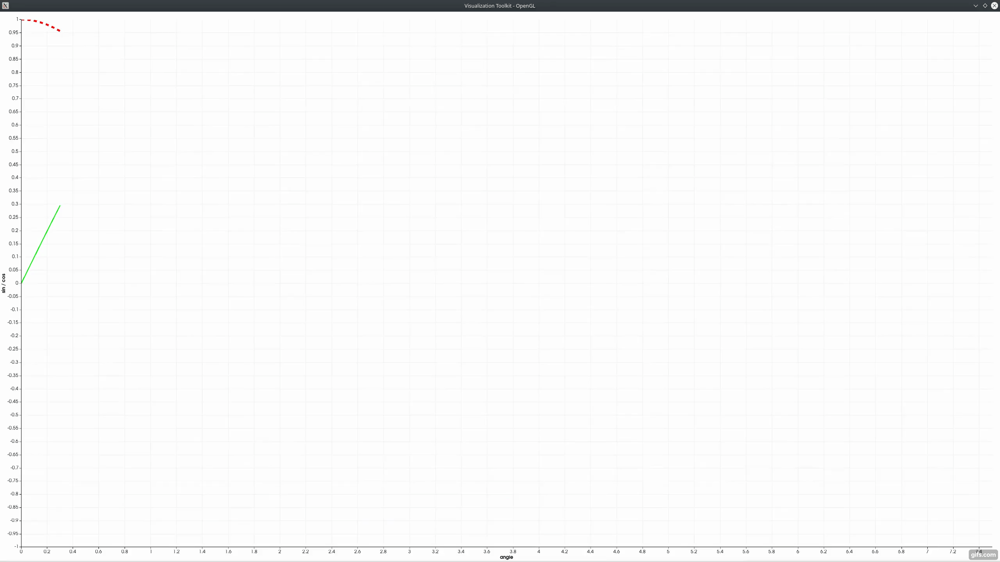

Motivation
-----
**VTK-realtime-plotter** is a C++ single header wrapper that brings **realtime** support to VTK XY plots through the use of threads.



Mechanism
-----
The ```VTKRealtimePlotter``` class is an extensible base class that provides interfaces for setup (adding columns, plots) and for realtime updates (inserting new values).

The class exposes its ```vtkContextView``` and ```vtkChartXY``` members for customizability following the VTK programming model.

A straightforward example of a deriving class is provided in ```example.cpp```.

Requirements
-----
The wrapper uses **C++20** features (**Cooperative Cancellation**) and requires a compatible compiler.

Usage
-----
To build and run the example:
```
mkdir build
cd build
cmake ..
make
./example
```